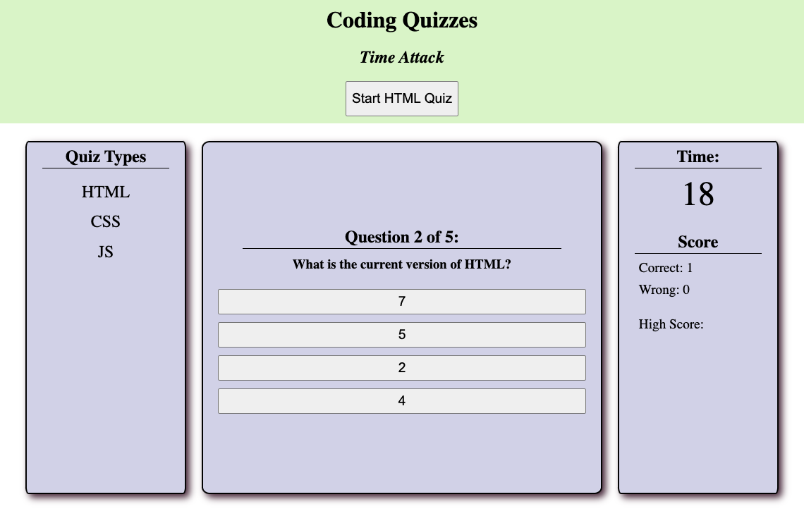

# Timed Quiz Game

This quiz website checks the user's knowledge of the three main web development component languages through a timed quiz with penalties for wrong answers. The number of correct and incorrect answers are displayed for each quiz along with the highscore, which is determined as the amount of time remaining after completing all questions.

After successful completion of the quiz, the user is prompted to record their initials to include with the highscore.

## Key Features:
- HTML, CSS, and JS quizzes available
- Timed game mode with penalties for incorrect answers
- Highscore and initials tracking
- Responsive layout based on device screen size

See the deployed application at: [Quiz Site](https://ellisonac.github.io/JS-Quiz/)

A screenshot of the final website is shown below: 
